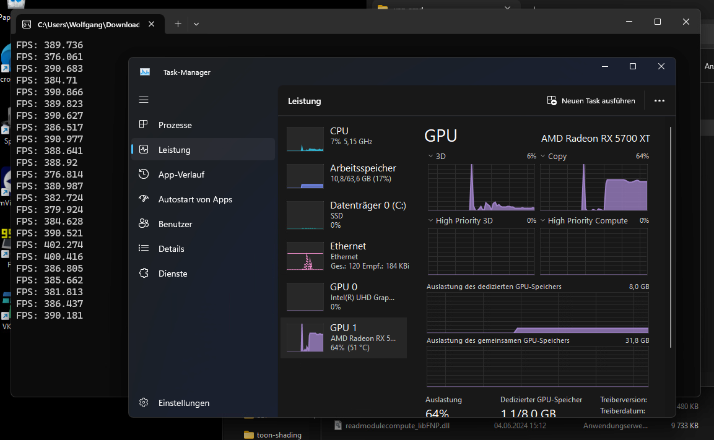
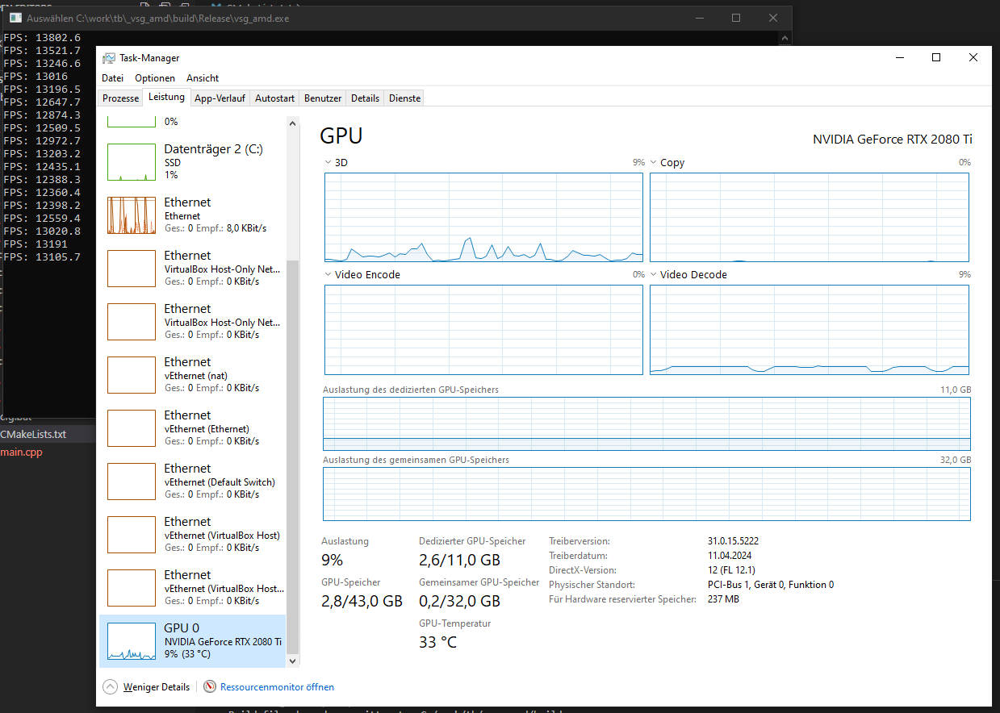
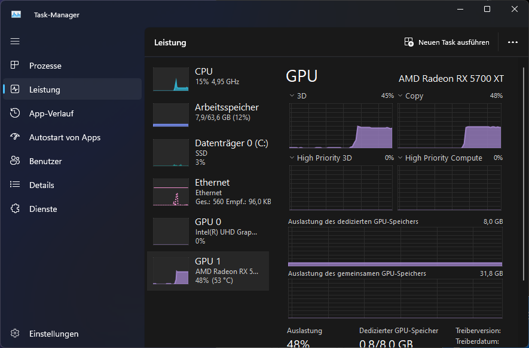

# About

This repo contains two minimal VSG applications that are minimal repro cases for AMD GPU performance issues on Windows.
(Linux performance has not yet been tested)

<u>**AMD Performance issue:**</u>

On Windows with AMD GPUs, the two included apps are showing heavy "Copy" workload in the Windows Task-Manager, and the achieved framerate (FPS) are far below what would be expected from such simple Vulkan apps.




For comparison, an NVidia RTX 2080 Ti running the same applications is showing little to no workload & delivering high FPS:



PS: For the vsg_amd_window_perf app, the Windows Task-Manager is additionally showing a 50% 3D workload, on top of the already unexpected 50% Copy workload.




# Initial Setup
<sup>(should only be needed once)</sup>

```
git submodule update --init --recursive
.\vcpkg\bootstrap-vcpkg.bat
configure.bat
```

# Building the applications

```
build.bat
OR
cmake --build build --config Release
```

⚠**IMPORTANT**: make sure you build the CMake `Release` config of the apps, the performance problems will be much less obvious in `Debug` builds!

# Running the applications

```
cd build\Release
vsg_amd_offscreen_perf.exe
vsg_amd_window_perf.exe
```

# App command-line options

## vsg_amd_offscreen_perf

* `--debug` | `-d` ... enable Vulkan validation layer
* `--api` | `-a` ... enable Vulkan api-dump layer
* `-n <int>` ... render the given number of frames and exit the application
* `-f` ... write frame-delimiter log messages to console
    * can be helpful when combined with `--api` | `-a`
* `--details` ... print Vulkan function argument details when using api-dump
* `--logfile` ... write the Vulkan api-dump output to a `vk_api.log` file instead of console

## vsg_amd_window_perf

* `--debug` | `-d` ... enable Vulkan validation layer
* `--api` | `-a` ... enable Vulkan api-dump layer
